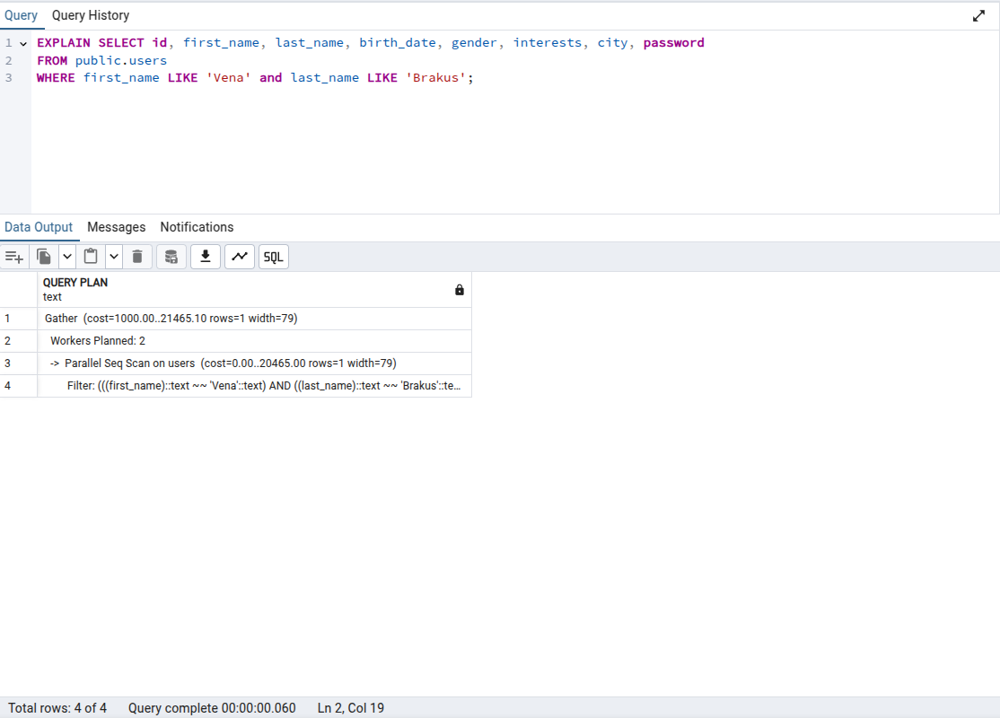
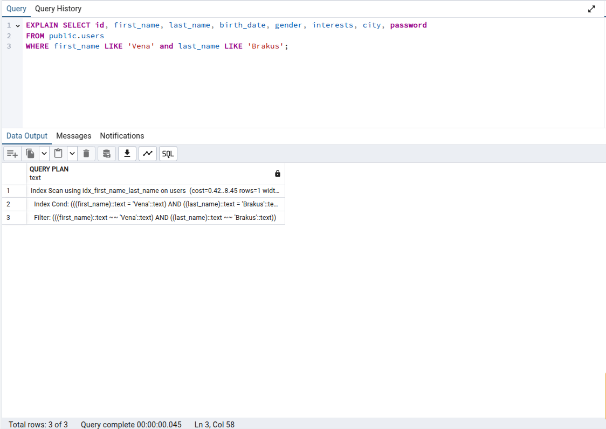
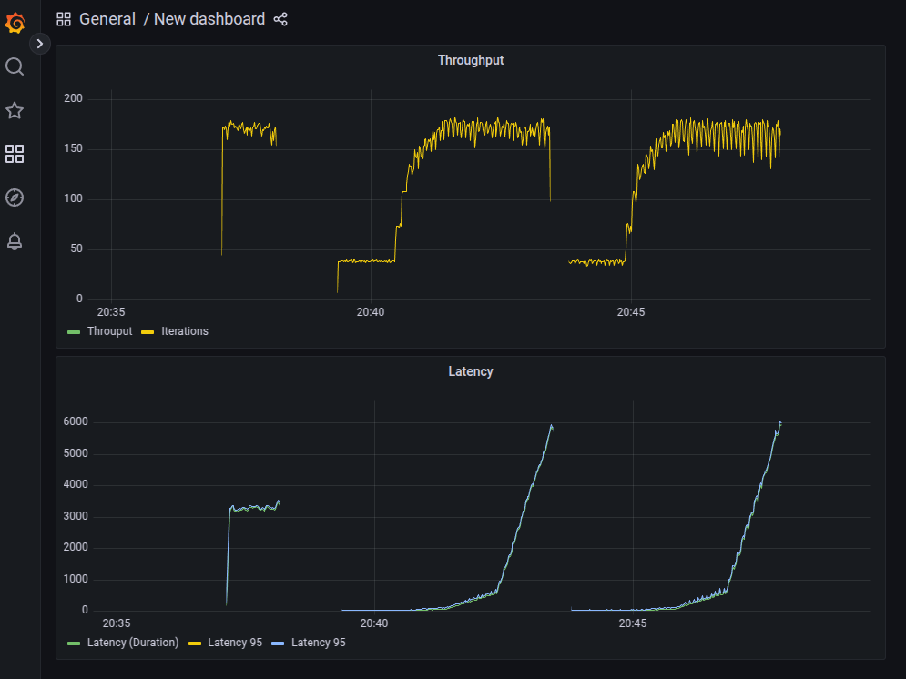

### Нагрузочное тестирование

Дано: 
* 1000000 пользователей
* Эндпоинт /api/users/search (параметры)
* Инструмент нагрузки - Grafana k6
* Инструмент отчетов Grafana + Influxdb
* Индекс выбран составной
```sql
CREATE INDEX idx_first_name_last_name ON users (first_name, last_name);
```

#### До индекса



```
data_received..................: 7.4 MB 30 kB/s
2025-01-23T17:43:27.567210362Z      data_sent......................: 4.2 MB 17 kB/s
2025-01-23T17:43:27.567212882Z      http_req_blocked...............: avg=15.99µs     min=1.14µs    med=3.05µs     max=58.77ms     p(90)=4.63µs      p(95)=5.71µs     
2025-01-23T17:43:27.567216012Z      http_req_connecting............: avg=11.03µs     min=0s        med=0s         max=58.72ms     p(90)=0s          p(95)=0s         
2025-01-23T17:43:27.567226172Z      http_req_duration..............: avg=1.26s       min=24.27ms   med=345.86ms   max=5.97s       p(90)=4.42s       p(95)=5.08s      
2025-01-23T17:43:27.567227832Z        { expected_response:true }...: avg=1.26s       min=24.27ms   med=345.86ms   max=5.97s       p(90)=4.42s       p(95)=5.08s      
2025-01-23T17:43:27.567229372Z      http_req_failed................: 0.00%  0 out of 31342
2025-01-23T17:43:27.567230942Z      http_req_receiving.............: avg=48.95µs     min=13.8µs    med=38.09µs    max=82.98ms     p(90)=61.86µs     p(95)=68.16µs    
2025-01-23T17:43:27.567232592Z      http_req_sending...............: avg=12.5µs      min=3.95µs    med=11.24µs    max=3.18ms      p(90)=16.34µs     p(95)=19.2µs     
2025-01-23T17:43:27.567234202Z      http_req_tls_handshaking.......: avg=0s          min=0s        med=0s         max=0s          p(90)=0s          p(95)=0s         
2025-01-23T17:43:27.567235752Z      http_req_waiting...............: avg=1.26s       min=24.22ms   med=345.8ms    max=5.97s       p(90)=4.42s       p(95)=5.08s      
2025-01-23T17:43:27.567237272Z      http_reqs......................: 31342  127.500726/s
2025-01-23T17:43:27.567238782Z      iteration_duration.............: avg=1.26s       min=24.37ms   med=346.02ms   max=5.97s       p(90)=4.42s       p(95)=5.08s      
2025-01-23T17:43:27.567240322Z      iterations.....................: 31342  127.500726/s
2025-01-23T17:43:27.567242402Z      response_time..................: avg=1261.035058 min=24.274635 med=345.863963 max=5971.592183 p(90)=4421.539696 p(95)=5084.257224
2025-01-23T17:43:27.567245112Z      vus............................: 4      min=1          max=997
2025-01-23T17:43:27.567247462Z      vus_max........................: 1000   min=1000       max=1000
```
После индекса

```
data_received..................: 7.2 MB 29 kB/s
2025-01-23T17:47:53.931328591Z      data_sent......................: 4.1 MB 17 kB/s
2025-01-23T17:47:53.931331671Z      http_req_blocked...............: avg=17.29µs     min=1.15µs    med=3.09µs     max=69.92ms     p(90)=4.75µs      p(95)=5.9µs      
2025-01-23T17:47:53.931335361Z      http_req_connecting............: avg=12.21µs     min=0s        med=0s         max=69.85ms     p(90)=0s          p(95)=0s         
2025-01-23T17:47:53.931338341Z      http_req_duration..............: avg=1.28s       min=23.87ms   med=352.8ms    max=6.06s       p(90)=4.4s        p(95)=5.44s      
2025-01-23T17:47:53.931341281Z        { expected_response:true }...: avg=1.28s       min=23.87ms   med=352.8ms    max=6.06s       p(90)=4.4s        p(95)=5.44s      
2025-01-23T17:47:53.931344231Z      http_req_failed................: 0.00%  0 out of 30694
2025-01-23T17:47:53.931347271Z      http_req_receiving.............: avg=49.73µs     min=11.94µs   med=38.78µs    max=75.02ms     p(90)=64.65µs     p(95)=72.67µs    
2025-01-23T17:47:53.931350281Z      http_req_sending...............: avg=12.66µs     min=3.92µs    med=11.29µs    max=1.58ms      p(90)=16.68µs     p(95)=20.17µs    
2025-01-23T17:47:53.931363221Z      http_req_tls_handshaking.......: avg=0s          min=0s        med=0s         max=0s          p(90)=0s          p(95)=0s         
2025-01-23T17:47:53.931365321Z      http_req_waiting...............: avg=1.28s       min=23.81ms   med=352.71ms   max=6.06s       p(90)=4.4s        p(95)=5.44s      
2025-01-23T17:47:53.931367261Z      http_reqs......................: 30694  124.801779/s
2025-01-23T17:47:53.931369121Z      iteration_duration.............: avg=1.28s       min=23.97ms   med=352.96ms   max=6.06s       p(90)=4.4s        p(95)=5.44s      
2025-01-23T17:47:53.931371011Z      iterations.....................: 30694  124.801779/s
2025-01-23T17:47:53.931372821Z      response_time..................: avg=1288.489871 min=23.875237 med=352.803322 max=6067.087121 p(90)=4404.054287 p(95)=5447.557774
2025-01-23T17:47:53.931374761Z      vus............................: 41     min=1          max=995
2025-01-23T17:47:53.931376641Z      vus_max........................: 1000   min=1000       max=1000
2025-01-23T17:47:53.931378521Z 
```

#### Отчет в графане

Данные:
1. 20:40 до индекса
2. 20:45 после индекса

