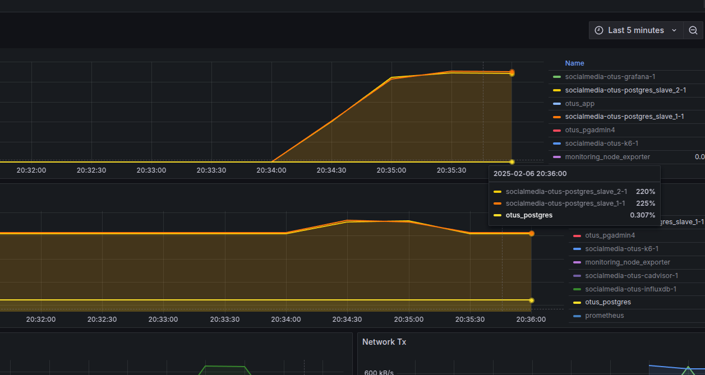
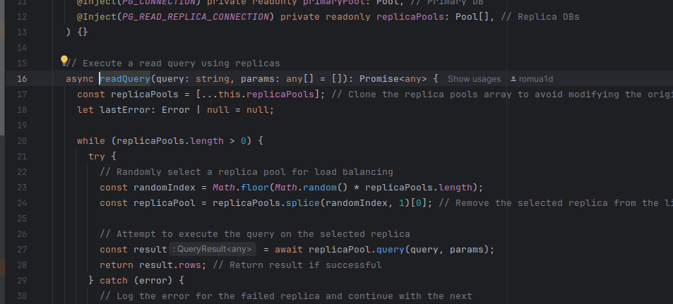
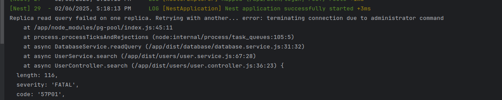
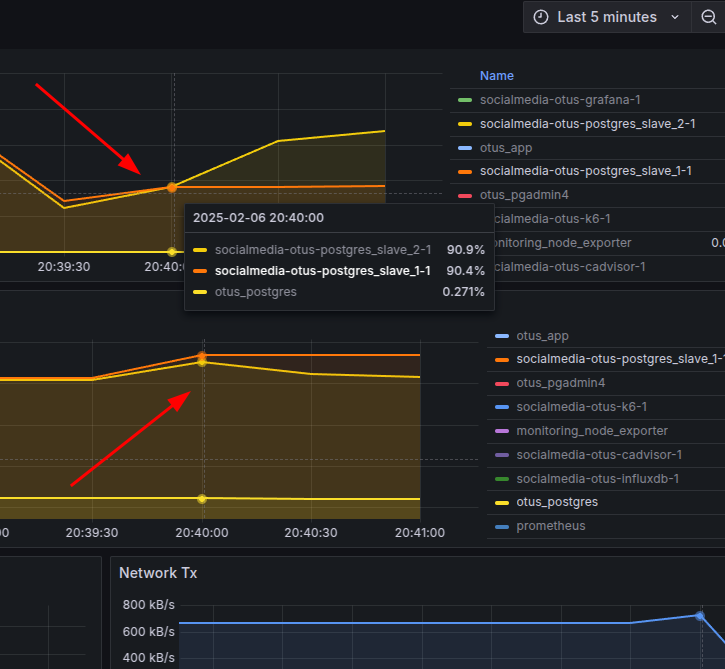
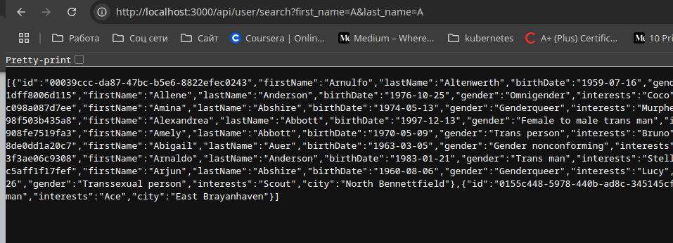
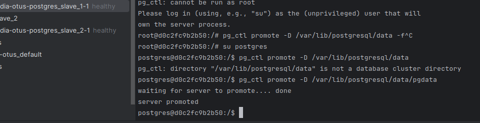
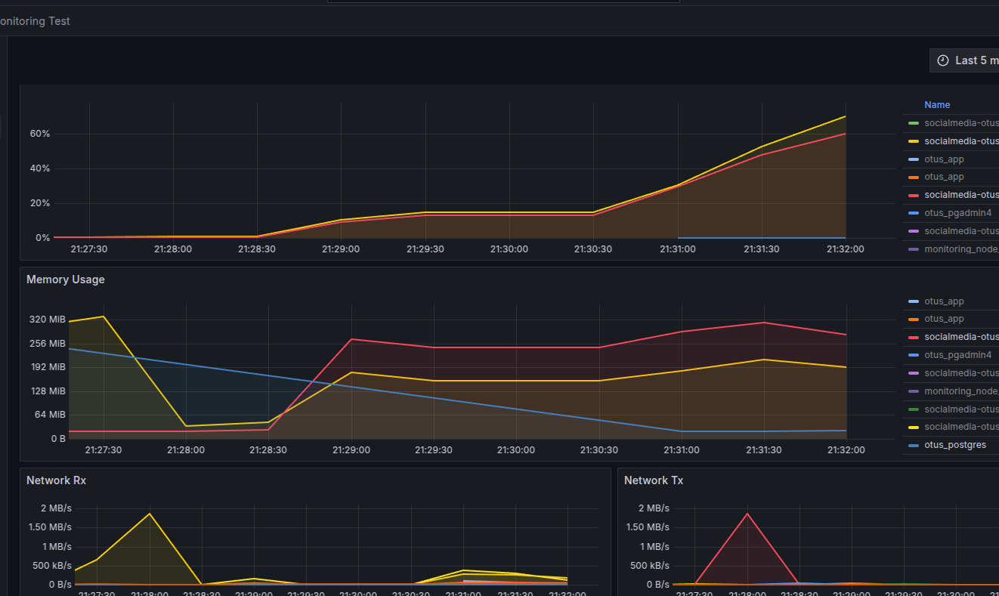
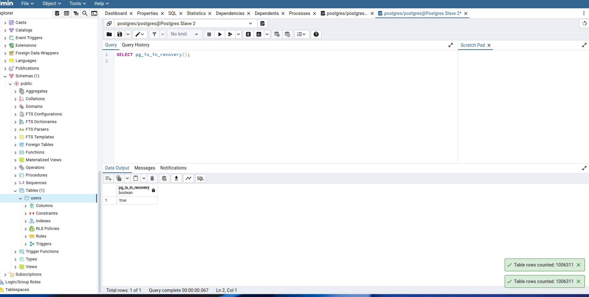

### 3 репликация

#### Настройка
* Настройка grafana docker monitoring сделана по этой статье https://medium.com/@varunjain2108/monitoring-docker-containers-with-cadvisor-prometheus-and-grafana-d101b4dbbc84
* Добавим строки в db master `hba.conf`
  * `host replication replicator 0.0.0.0/0 trust`
* Выполню для слейвов бэкап 
  * `pg_basebackup -h db -D /var/lib/postgresql/data -U replication --password --checkpoint=fast --wal-method=stream`

#### Нагрузка на реплики, запросы на чтение

#### Код выбора базы на чтение из реплик

#### Нагружаем систему и отключаем 1 реплику
Ошибки в консоли

Потеря подключения к 1 реплике

Тем не менее бэкенд отвечает

#### Стопаем master и делаем slave1 master 

Проверяем стал ли мастером?

Слейв2 остался репликой но для нового мастера

